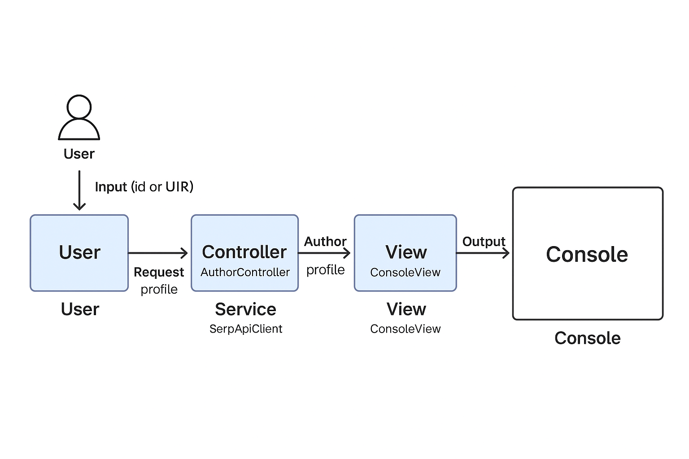

# Google Scholar API – SerpApi Integration with MVC
A simple Java MVC application that fetches and displays **Google Scholar author profiles** using the **SerpApi Google Scholar API**.  
The project demonstrates a clean separation of concerns with **Model–View–Controller** architecture.



## 📖 Project Purpose
The goal of this project is to **explore and document the use of the Google Scholar API through SerpApi**. It includes a technical report summarizing essential API details and a functional GitHub repository with clear documentation for collaboration.

---

## 🚀 Key Functionalities
- **SerpApi Setup**
    - Created a SerpApi account under the free plan.
    - Obtained an API key to authenticate requests.

- **Technical Documentation**
    - Endpoints (URLs used to query the API).
    - Authentication methods.
    - Query parameters for filtering and customization.
    - Response formats (JSON).
    - Usage limits under the free plan.
    - Code examples in multiple programming languages.

- **GitHub Repository**
    - Contains this README (project overview + full technical report).
    - Configured access for the **Digital NAO team**.

---

## 📌 Project Relevance
- Facilitates **academic research automation** by retrieving structured results from Google Scholar.
- Provides a **developer-friendly guide** to using the SerpApi Google Scholar integration.
- Ensures **reproducibility** with code examples and clear documentation.

---

## 🛠️ Technologies Used
- **SerpApi – Google Scholar API**
- **JSON** (response format)
- **Python, Node.js, Java** (example integrations)
- **GitHub** (project hosting and collaboration)

---

# 📑 Technical Report – Google Scholar API (SerpApi)

## 1. Endpoints
Base URL:
```
https://serpapi.com/search
```

- **Google Scholar Author Search**
  ```
  https://serpapi.com/search?engine=google_scholar_author
  ```

- **Google Scholar Search (Articles/Keywords)**
  ```
  https://serpapi.com/search?engine=google_scholar
  ```

---

## 2. Authentication Methods
- Sign up at [https://serpapi.com](https://serpapi.com).
- Retrieve API key from your dashboard.
- Add it to each request:

```
https://serpapi.com/search?engine=google_scholar&q=machine+learning&api_key=YOUR_API_KEY
```

---

## 3. Query Parameters

| Parameter | Description | Example |
|-----------|-------------|---------|
| `q` | Search query string | `q=quantum+computing` |
| `engine` | Specifies the engine | `engine=google_scholar` |
| `api_key` | Authentication key | `api_key=xxxx` |
| `hl` | Language of results | `hl=en` |
| `start` | Pagination offset | `start=10` |
| `author_id` | Search by author ID | `author_id=AbC123XYZ` |

---

## 4. Response Formats
Responses are in **JSON**.

Example:
```json
{
  "organic_results": [
    {
      "title": "Deep Learning",
      "authors": "Y. LeCun, Y. Bengio, G. Hinton",
      "publication_date": "2015",
      "link": "https://scholar.google.com/scholar?cluster=123456",
      "cited_by": 20000
    }
  ]
}
```

---

## 5. Usage Limits
- **Free Plan**: 100 searches/month.
- **Rate Limit**: 1 request/second.
- Higher usage requires a paid plan.

---

## 6. Code Examples

### Python
```python
import requests

params = {
    "engine": "google_scholar",
    "q": "artificial intelligence",
    "api_key": "YOUR_API_KEY"
}

response = requests.get("https://serpapi.com/search", params=params)
data = response.json()

for result in data.get("organic_results", []):
    print(result["title"], "-", result["authors"])
```

### JavaScript (Node.js)
```javascript
const axios = require("axios");

async function scholarSearch() {
  const response = await axios.get("https://serpapi.com/search", {
    params: {
      engine: "google_scholar",
      q: "data science",
      api_key: "YOUR_API_KEY"
    }
  });
  console.log(response.data.organic_results);
}

scholarSearch();
```

### Java (HttpClient)
```java
import java.net.http.*;
import java.net.URI;

public class ScholarSearch {
    public static void main(String[] args) throws Exception {
        HttpClient client = HttpClient.newHttpClient();
        HttpRequest request = HttpRequest.newBuilder()
            .uri(URI.create("https://serpapi.com/search?engine=google_scholar&q=machine+learning&api_key=YOUR_API_KEY"))
            .build();

        HttpResponse<String> response = client.send(request, HttpResponse.BodyHandlers.ofString());
        System.out.println(response.body());
    }
}
```

---


## 🚀 Features
- Input: either a **Google Scholar profile URL** or a plain **author_id**.
- Extracts and displays:
    - Author name and affiliation
    - Citation metrics (**Citations, h-index, i10-index**)
    - Top 5 articles with title, year, publication, and citation count
- Clean **console view** with formatted tables
- Error handling with friendly messages

---

## 🛠️ Technologies
- **Java 17+**
- **Maven** for dependency management and build
- **Apache HttpClient 5** – to make HTTP requests
- **Jackson** – to parse JSON responses
- **SerpApi** – external API provider for Google Scholar data

---

## 📂 Project Structure
```
src/main/java/org/example/scholar/
│
├── model/         # Data models (AuthorProfile, etc.)
├── view/          # ConsoleView: displays data in the console
├── service/       # SerpApiClient + ScholarUtils (API integration)
└── controller/    # AuthorController: coordinates MVC flow
```

---

## ⚙️ Setup

### 1. Clone the repository
```bash
git clone https://github.com/your-username/scholar-mvc.git
cd scholar-mvc
```

### 2. Configure your SerpApi key
Get a free API key from [SerpApi](https://serpapi.com/).  
Set the environment variable `SERPAPI_KEY`:

- **Linux / Mac (bash):**
  ```bash
  export SERPAPI_KEY=your_api_key_here
  ```

- **Windows PowerShell:**
  ```powershell
  setx SERPAPI_KEY "your_api_key_here"
  ```

*(Restart your terminal or IDE after setting the variable)*

---

## ▶️ Build and Run

### Compile with Maven
```bash
mvn clean package
```

### Run with author_id
```bash
java -cp target/scholar-mvc-1.0.0.jar org.example.scholar.Main FyYiDG0AAAAJ
```

### Run with profile URL
```bash
java -cp target/scholar-mvc-1.0.0.jar org.example.scholar.Main "https://scholar.google.com/citations?user=FyYiDG0AAAAJ"
```

---

## 📊 Example Output

```
=== Google Scholar (SerpApi) - Demo MVC ===
(SERPAPI_KEY: ****ecd6)

=== AUTHOR PROFILE ===
Name: Sandra Rodil
Affiliation: Instituto de Investigaciones en Materiales, Universidad Nacional Autónoma de México

Metrics:
+----------------+---------+
| Citations      |    8454 |
| h-index        |      49 |
| i10-index      |     132 |
+----------------+---------+

Top Articles:
 - Interpretation of infrared and Raman spectra of amorphous carbon nitrides (2003) · Physical Review B | Citations: 930
   https://scholar.google.com/citations?view_op=view_citation&citation_for_view=FyYiDG0AAAAJ:u-x6o8ySG0sC
 - Density, fraction, and cross-sectional structure of amorphous carbon films (2000) · Physical Review B | Citations: 717
   https://scholar.google.com/citations?view_op=view_citation&citation_for_view=FyYiDG0AAAAJ:u5HHmVD_uO8C
 ...
```

---
## 📌 Utility and Scope Scenarios
- **Academic Research**: Helps researchers, students, and administrators quickly obtain citation metrics and top publications from Google Scholar profiles.
- **Institutional Reports**: Can be integrated into university systems to auto-generate performance metrics of faculty members.
- **Data Analysis**: Provides structured data that can later be extended into dashboards or research analytics platforms.

---

## 🌱 Sustainability
- The project leverages **SerpApi**, an established API provider, reducing the need for custom scraping (which may break frequently).
- Code is modular (MVC pattern), making it easy to maintain and extend over time.
- Open-source approach allows community contributions to ensure long-term project health.

---

## ⚙️ Applicability of Technical Aspects
- Demonstrates the use of **MVC in Java**, a widely adopted design pattern.
- Shows integration with an **external REST API** using Apache HttpClient and JSON parsing with Jackson.
- Can be extended into GUI applications or web backends with minimal changes.

---

## 📈 Scalability, Economic Viability, and Impact
- **Scalability**: The architecture allows integration with multiple APIs (e.g., OpenAlex, Scopus, PubMed) to broaden coverage beyond Google Scholar.
- **Economic Viability**: SerpApi has free and paid tiers, making it cost-effective for small projects and scalable for enterprise-level usage.
- **Impact**: Facilitates data-driven decisions in academia and research policy by providing transparent and structured author metrics.

---

## ⚠️ Notes
- The **Google Scholar Profiles API** has been discontinued. This project uses the **Google Scholar Author API** via SerpApi.
- Free SerpApi accounts have **request limits**. If you hit errors like `HTTP 403`, check your quota.

---

## 📜 License
This project is for **educational purposes** (demonstrating MVC in Java).  
Check SerpApi’s [Terms of Service](https://serpapi.com/legal) before production use.


## Conclusion
The **Google Scholar API via SerpApi** provides developers with a structured way to query authors, articles, and citation data.

By following this documentation, you can:
- Retrieve research results and author data.
- Integrate results into applications or databases.
- Handle authentication, query customization, and usage limits effectively.  
